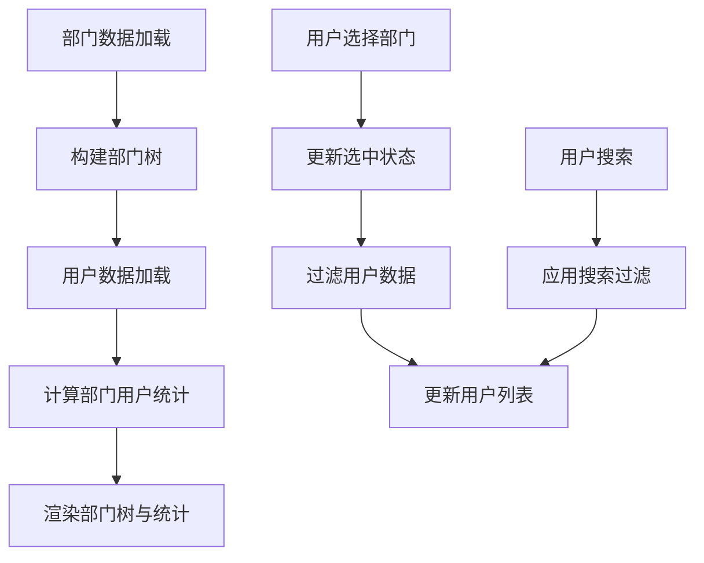

# 用户管理页面重构说明

## 🎯 重构目标

将用户管理页面改为**左边部门树形结构，右边显示用户数据**的布局，提供更好的用户体验和数据组织方式。

## 📋 主要改进

### 1. 布局结构优化
- **左侧部门树**: 显示完整的部门层级结构
- **右侧用户列表**: 根据选中部门动态显示对应用户
- **响应式设计**: 支持不同屏幕尺寸的自适应布局

### 2. 功能增强

#### 部门树功能
- ✅ **用户数量统计**: 每个部门显示用户总数徽章
- ✅ **搜索功能**: 支持部门名称搜索，自动展开匹配节点
- ✅ **状态统计**: 鼠标悬停显示正常/禁用用户数量
- ✅ **全部数据**: 支持显示全部用户（不按部门过滤）

#### 用户列表功能
- ✅ **部门过滤**: 根据选中部门自动过滤用户列表
- ✅ **关键词搜索**: 支持按姓名、用户名、邮箱、手机号搜索
- ✅ **部门信息**: 显示当前选中部门的统计信息
- ✅ **快速新增**: 新增用户时自动设置当前选中部门

## 🔧 技术实现

### 文件结构
```
src/
├── pages/system/
│   └── UserManage.jsx          # 主用户管理页面
├── components/
│   └── UserManageDeptTree.jsx  # 专用部门树组件
└── stores/
    └── dept.js                 # 部门数据状态管理
```

### 核心组件

#### 1. UserManage.jsx (主页面)
```javascript
// 主要状态
const [selectedDeptId, setSelectedDeptId] = useState(null)     // 选中的部门ID
const [selectedDeptInfo, setSelectedDeptInfo] = useState(null) // 选中的部门信息
const [searchKeyword, setSearchKeyword] = useState('')        // 搜索关键词

// 数据过滤
const filteredUsers = useMemo(() => {
  let filtered = users
  
  // 按部门过滤
  if (selectedDeptId) {
    filtered = filtered.filter(user => user.deptId === selectedDeptId)
  }
  
  // 按关键词过滤
  if (searchKeyword) {
    // ... 搜索逻辑
  }
  
  return filtered
}, [users, selectedDeptId, searchKeyword])
```

#### 2. UserManageDeptTree.jsx (部门树组件)
```javascript
// 主要功能
- 部门树展示和搜索
- 用户数量统计显示
- 部门选择事件处理
- 搜索高亮和自动展开
```

### 布局设计

#### 响应式栅格布局
```javascript
<Row gutter={16}>
  {/* 左侧部门树 */}
  <Col xs={24} sm={24} md={6} lg={6} xl={5}>
    {/* 部门树内容 */}
  </Col>
  
  {/* 右侧用户列表 */}
  <Col xs={24} sm={24} md={18} lg={18} xl={19}>
    {/* 用户列表内容 */}
  </Col>
</Row>
```

#### 屏幕适配
| 屏幕大小 | 部门树宽度 | 用户列表宽度 |
|---------|-----------|-------------|
| 超小屏幕 | 100% | 100% (垂直布局) |
| 小屏幕 | 100% | 100% (垂直布局) |
| 中等屏幕 | 25% | 75% |
| 大屏幕 | 25% | 75% |
| 超大屏幕 | 20% | 80% |

## 🎨 界面特性

### 部门树区域
- **固定高度**: 防止内容过多时撑开页面
- **滚动条**: 内容超出时显示垂直滚动条
- **搜索框**: 顶部固定搜索框，支持实时搜索
- **徽章显示**: 用户数量以绿色徽章形式显示
- **工具提示**: 鼠标悬停显示详细统计信息

### 用户列表区域
- **动态标题**: 显示当前选中部门名称
- **统计信息**: 显示部门用户的总数、正常、禁用状态统计
- **搜索功能**: 独立的用户搜索框
- **空状态**: 未选择部门时显示友好的空状态提示

## 📊 数据流

### 状态管理流程


### 数据统计计算
```javascript
// 部门用户统计
const deptUserStats = useMemo(() => {
  const stats = {}
  users.forEach(user => {
    if (!stats[user.deptId]) {
      stats[user.deptId] = { total: 0, active: 0, inactive: 0 }
    }
    stats[user.deptId].total += 1
    if (user.status === 'active') {
      stats[user.deptId].active += 1
    } else {
      stats[user.deptId].inactive += 1
    }
  })
  return stats
}, [users])
```

## 🔄 交互流程

### 1. 部门选择流程
1. 用户点击部门树中的某个部门
2. 更新`selectedDeptId`和`selectedDeptInfo`状态
3. 用户列表自动过滤，只显示该部门的用户
4. 显示部门统计信息

### 2. 用户搜索流程
1. 用户在搜索框输入关键词
2. 更新`searchKeyword`状态
3. 用户列表根据关键词进行二次过滤
4. 支持按姓名、用户名、邮箱、手机号搜索

### 3. 新增用户流程
1. 用户点击"新增用户"按钮
2. 如果当前选中了部门，自动设置为默认部门
3. 打开用户表单模态框
4. 用户填写信息并保存

## 💡 优化亮点

### 1. 用户体验优化
- **直观的数据组织**: 按部门层级清晰展示
- **高效的数据查找**: 支持部门过滤 + 关键词搜索
- **实时反馈**: 操作立即反映在界面上
- **智能默认**: 新增用户时智能设置默认部门

### 2. 性能优化
- **useMemo缓存**: 避免不必要的计算和渲染
- **懒加载**: 只渲染当前可见的数据
- **搜索防抖**: 避免频繁的搜索操作

### 3. 代码复用
- **独立组件**: UserManageDeptTree可复用到其他场景
- **状态管理**: 基于Zustand的部门状态管理
- **API集成**: 为后续API对接做好准备

## 🚀 使用方式

### 访问路径
```
/system/user
```

### 主要操作
1. **查看部门用户**: 点击左侧部门树节点
2. **搜索用户**: 使用右上角搜索框
3. **新增用户**: 点击"新增用户"按钮（自动关联当前部门）
4. **编辑用户**: 点击用户列表中的"编辑"按钮
5. **删除用户**: 点击用户列表中的"删除"按钮

## 📱 移动端适配

在移动设备上，布局会自动调整为垂直堆叠：
- 上方显示部门树
- 下方显示用户列表
- 保持所有功能的完整性

## 🔮 后续扩展

1. **批量操作**: 支持批量分配部门、角色等
2. **数据导出**: 按部门导出用户数据
3. **权限控制**: 根据数据权限范围过滤可见部门
4. **实时更新**: WebSocket推送用户状态变更
5. **高级搜索**: 支持更多搜索条件和筛选器